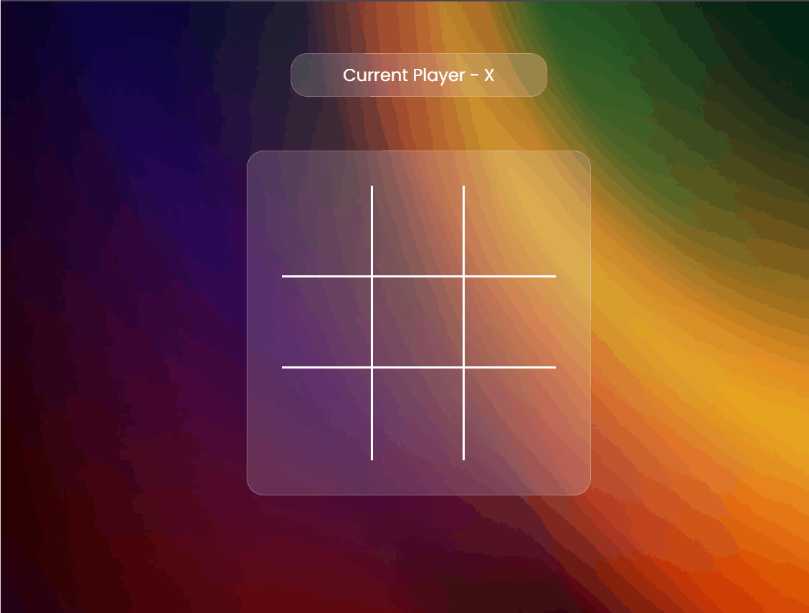

# Tic-Tac-Toe Game 🎮

[](https://tic-tac-toe-anubhav-sainis-projects-b4d0d046.vercel.app/)

This is a **Tic-Tac-Toe** game built with HTML, CSS, and JavaScript, offering a fun and interactive way to play the classic game. The game features a celebration animation on victory and a simple, clean user interface.

## 🚀 Live Demo



Check out the live version here:  
👉 [Tic-Tac-Toe Live](https://tic-tac-toe-anubhav-sainis-projects-b4d0d046.vercel.app/)

## 🎯 Features

- **Classic Gameplay**: Play a standard 3x3 Tic-Tac-Toe game.
- **Victory Celebration**: Confetti animation and highlighting of the winning boxes.
- **Tie Detection**: Displays a "Game Tied!" message when the grid is fully filled without a winner.
- **Responsive Design**: Works on both desktop and mobile devices.
- **New Game Button**: Easily restart the game at any time.

## 🛠️ Built With

- **HTML5**: For the game's structure.
- **CSS3**: For the design and layout, including animations and responsiveness.
- **JavaScript (ES6)**: Manages game logic, user interaction, and victory animations.
- **Canvas-Confetti**: Used for the confetti effect when a player wins.

## 🎮 How to Play

1. The game is played between two players: **X** and **O**.
2. Player **X** always starts the game.
3. Players take turns marking an empty square in the grid.
4. The first player to get three in a row (vertically, horizontally, or diagonally) wins the game.
5. If all nine squares are filled and there is no winner, the game ends in a tie.

## 🎥 Game Animation

Below is a sample animation of the Tic-Tac-Toe game in action:


> **Note**: The above GIF is scaled for better readability. If you want to view the full-resolution version, please check it in the `assets` folder.

## 📂 Project Structure

```bash
├── index.html        # The main HTML file
├── style.css         # Contains all CSS styles
├── index.js          # JavaScript file for game logic
├── assets/
│   └── gradient-bg.jpg  # Background image
│   └── AnimationTicTacToe.gif  # GIF file showing game animation
└── README.md         # Project documentation (this file)
